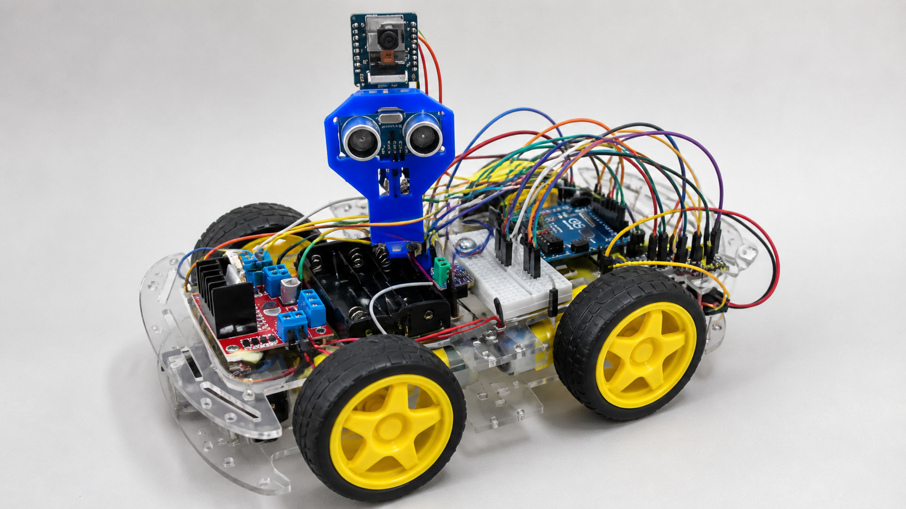
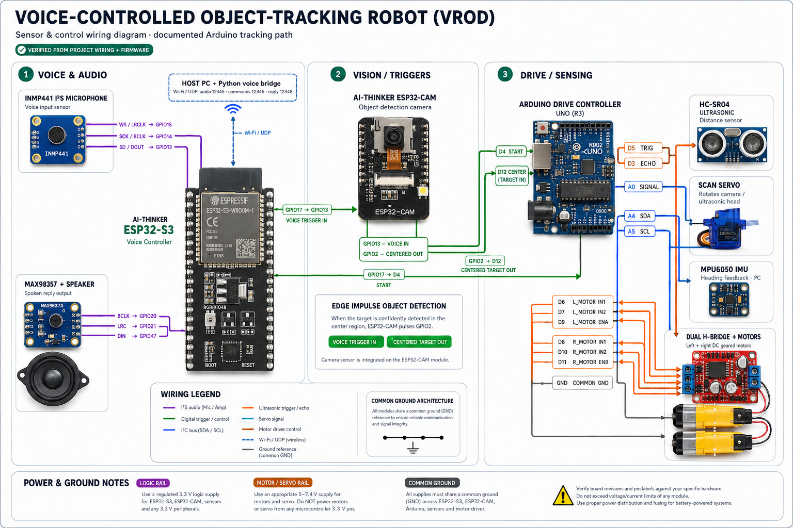

# Voice-Controlled Object-Tracking Robot (VROD)

<p align="center">
  
</p>

<p align="center"><em>AI-assisted background cleanup of the real VROD prototype.</em></p>

A multi-controller robot car that listens for a spoken target command, scans
with an ESP32-CAM and Edge Impulse object-detection model, aligns toward the
target with servo and MPU6050 feedback, and approaches it while maintaining a
safe ultrasonic stopping distance.

## What it does

- Streams microphone audio from an ESP32-S3 to a Python speech bridge over UDP.
- Recognizes commands such as `BAG`, `FORWARD`, `BACKWARD`, `LEFT`, `RIGHT`, and
  `STOP`.
- Uses `BAG` to start the end-to-end voice-triggered tracking sequence.
- Runs an Edge Impulse bag-detection model on an AI-Thinker ESP32-CAM.
- Sweeps a servo, aligns the chassis using an MPU6050, and drives the four-wheel
  chassis as paired left/right motor channels.
- Stops near an obstacle/target using an HC-SR04 ultrasonic sensor.
- Provides an ESP32-CAM browser stream and an optional ESP32/Blynk drive
  alternative.
- Can return optional Gemini/gTTS spoken responses through a MAX98357 speaker.

## System at a glance

```text
Voice -> ESP32-S3 -> Python speech bridge -> ESP32-S3 trigger
                                              |        |
                                              v        v
                                          ESP32-CAM  Drive Arduino
                                              |        |
                                              +------> align + approach
```

See [System architecture](docs/ARCHITECTURE.md) for the full data and control
flow.

## Wiring diagram

<p align="center">
  
</p>

> **Power clarification:** the signal mapping above reflects the documented
> Arduino tracking path, but the diagram's `7.4 V supply for motors and servo`
> wording must not be interpreted as applying raw 7.4 V to a typical micro
> servo. Use a separately regulated voltage within the exact servo's rating
> (commonly 5–6 V), use the appropriate regulated input for each controller,
> and connect all grounds together. Treat the diagram as a connection overview;
> verify every voltage against the exact module and power supply you use. The
> two motor symbols represent the left and right drive channels; the real 4WD
> chassis has two motors per channel, subject to the driver's current rating.

## Hardware

- ESP32-S3 development board
- AI-Thinker ESP32-CAM with PSRAM
- Arduino Uno/Nano-compatible drive controller (documented tracking path)
- Optional ESP32 drive-controller board for the Blynk-enabled alternative
- INMP441 I2S microphone
- MAX98357 I2S amplifier and small speaker
- MPU6050 IMU
- HC-SR04 ultrasonic sensor
- Micro servo for scanning
- Dual H-bridge motor driver, four DC geared motors wired as left/right pairs,
  four wheels, and chassis
- Separate suitable motor/servo and logic power supplies

## Repository layout

```text
firmware/
  voice-controller/   ESP32-S3 microphone, speaker, UDP, and trigger firmware
  vision-controller/  ESP32-CAM streaming and Edge Impulse inference
  drive-controller-arduino/       Integrated tracking state machine
  drive-controller-esp32-blynk/   Optional ESP32/Blynk tracking controller
host/
  voice_bridge.py      PC speech recognition, command bridge, and optional TTS
models/                Installable Edge Impulse Arduino library export
docs/                  Architecture, wiring, and project images
```

## Quick start

### 1. Prepare Arduino IDE

Install the ESP32 board package and these libraries:

- Servo library
- I2Cdevlib (`I2Cdev` and `MPU6050`)
- The included Edge Impulse archive, following
  [models/README.md](models/README.md)

In `voice-controller/` and `vision-controller/`, copy `secrets.example.h` to
`secrets.h` and enter your local Wi-Fi and host IP values. `secrets.h` is
ignored by Git.

Flash the three sketches to their corresponding boards:

1. `firmware/voice-controller/voice-controller.ino`
2. `firmware/vision-controller/vision-controller.ino`
3. `firmware/drive-controller-arduino/drive-controller-arduino.ino`

Use Serial Monitor at 115200 baud to note the assigned IP addresses and verify
startup. Set the host IP in the voice controller's `secrets.h`.

As an alternative to step 3, the ESP32/Blynk drive sketch implements the same
camera-guided scan, alignment, approach, and safety-stop sequence plus manual
Blynk controls while idle. Install Blynk and ESP32Servo, copy its
`secrets.example.h` to `secrets.h`, and use its separate ESP32 pin map from the
[wiring reference](docs/WIRING.md).

### 2. Start the host speech bridge

Python 3.10+ and FFmpeg are recommended.

```powershell
cd host
python -m venv .venv
.\.venv\Scripts\Activate.ps1
pip install -r requirements.txt
$env:VROD_ESP32_IP = "192.168.1.100"
$env:VROD_PC_IP = "192.168.1.10"
python voice_bridge.py
```

Replace the example addresses with the ESP32-S3 and host addresses. Set
`GEMINI_API_KEY` only if you want non-command conversational responses. The
default is `gemini-2.5-flash`; set `GEMINI_MODEL` to use another available model.

### 3. Wire and test

Follow [the wiring reference](docs/WIRING.md). Test in this order:

1. Confirm all controllers share ground and boot without motors enabled.
2. Confirm microphone UDP packets arrive at the host.
3. Say “find bag” and check that GPIO17 pulses.
4. Confirm the camera enters detection mode and pulses GPIO2 when centered.
5. Raise the chassis so the wheels can spin freely, then test alignment/motion.
6. Test on the floor at low motor speed and tune thresholds gradually.

## Project photos

The README hero is based directly on the real robot's front and top views. It
preserves the transparent acrylic chassis, four yellow wheels, blue ultrasonic
and camera tower, Arduino, motor driver, battery holder, breadboard, controller
boards, and the prototype's actual jumper wiring.

The unmodified robot-only references are retained for provenance:
[front view](docs/images/references/actual-robot-front-original.jpeg) and
[top view](docs/images/references/actual-robot-top-original.jpeg). See the
[gallery notes](docs/images/README.md) for the distinction between the cleaned
hero, source photographs, and archived early concepts.

## Safety and known limitations

- The firmware remains a prototype: successful compilation does not replace
  bench testing on the exact boards, sensors, motor driver, and power rails.
- The ultrasonic ECHO line needs 5 V-to-3.3 V level shifting when connected to
  the optional 3.3 V ESP32 drive controller. The documented 5 V Arduino path
  does not require that divider.
- If you try the optional ESP32 drive port, its GPIO12 input may interfere with
  boot depending on the board and signal state.
- Begin motor tests with wheels off the ground and provide an easy power cutoff.
- Only `BAG` currently activates the voice-to-tracking GPIO path. Other motion
  commands are recognized but are placeholders in the voice-controller sketch;
  the optional ESP32/Blynk sketch provides manual movement controls.

## Before making the repository public

- Confirm that the selected project photographs are suitable for public release
  and remove metadata if needed.
- Rotate any Wi-Fi, Blynk, or API credentials that were previously embedded in
  local source files. This repository copy contains placeholders only.
- Choose a license after confirming ownership and third-party obligations. No
  top-level license is included yet.

## Source note

This repository was assembled from the project's final Arduino sketches, the
integrated ESP32-CAM test sketch, the host `mega.py` voice bridge, and the
exported Edge Impulse bag-detection Arduino library. The organized copies were
then corrected for protocol consistency, controller safety, and current board
APIs. The hero image was rebuilt from photographs of the real prototype
supplied by the project owner.
