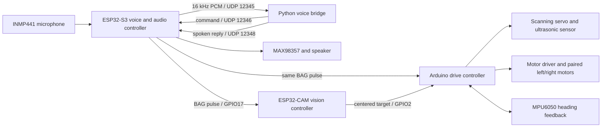

# System architecture

The documented prototype path distributes work across two ESP32-family boards,
an Arduino drive controller, and one host PC.

## Tracking sequence

1. The ESP32-S3 streams microphone samples to the host computer.
2. The Python bridge recognizes speech and sends an uppercase command back.
3. For `BAG`, the ESP32-S3 raises GPIO17 for one second.
4. That pulse starts both the camera detector and the drive controller's servo
   scan.
5. The ESP32-CAM runs the Edge Impulse model. When a confident target is in the
   center region, it pulses GPIO2.
6. The drive controller stops the scan, aligns the chassis using the MPU6050,
   drives toward the target, and stops within the configured ultrasonic range.

## Current limitations

- The host bridge uses online Google speech recognition.
- Conversational AI and TTS are optional; command recognition works without a
  Gemini key.
- `FORWARD`, `BACKWARD`, `LEFT`, `RIGHT`, and `STOP` are recognized by the host,
  but the current voice firmware only logs those commands.
- The optional ESP32/Blynk drive controller implements the same automatic
  tracking sequence and adds manual Blynk movement controls while idle. It uses
  a different pin map from the documented Arduino tracking path.
- The prototype expects all controllers to share a common ground.
